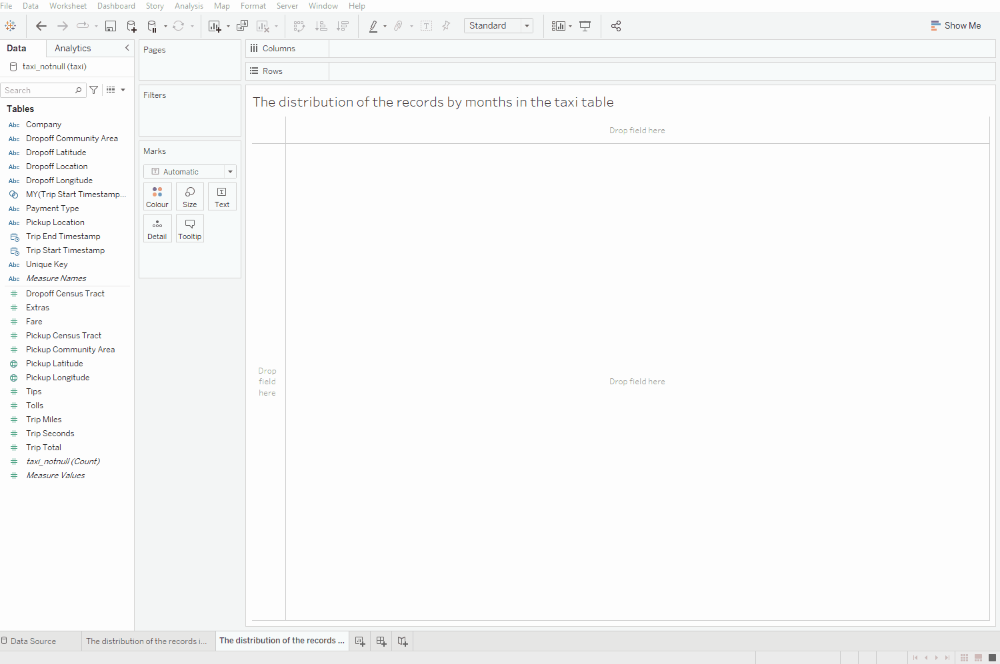
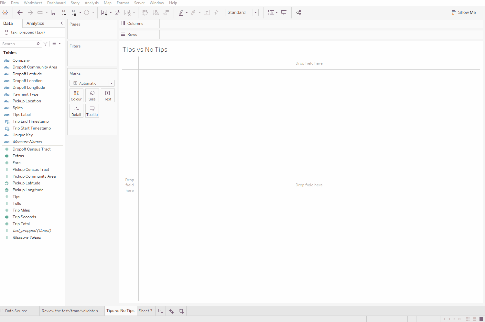
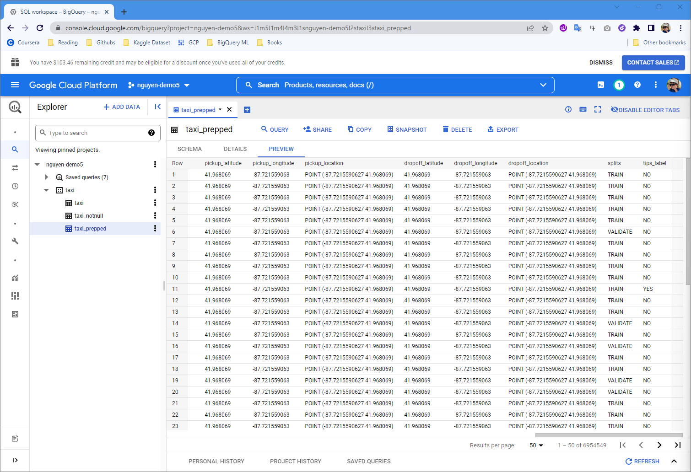

# nguyen-demo5: Vertex AI - BigQuery Machine Learning
---
## Predicting Boolean Values Using Binary Logistic Regression
------------
### Overview:
- Introducing the business scenario
- Exploring, understanding and visualizing the dataset using Tableau
- Training the binary logistic regression model
- Evaluating the binary logistic regression model
- Using the binary logistic regression model
- Drawing business conclusions
----------
#### Introducing the business scenario  

- In this section, we'll introduce the business scenario that will be tackled with binary
logistic regression.
- Let's take an example wherein you are a taxi driver who is passionate about ML. You're
currently working in Chicago and your goal is to provide an additional tool to all your
colleagues to understand the probability of getting a tip from your customers.
- Getting a tip from a customer is very important for taxi drivers to increase their income.
- Predicting the probability of getting a tip can be useful to, for example, know when to
reserve a particularly gentle treatment for a specific subset of customers.

- The city of Chicago has collected information about most of the taxi trips that have occurred since 2013. This dataset is available in the BigQuery public datasets marketplace `(https://console.cloud.google.com/marketplace/details/city-of-chicagopublic-data/chicago-taxi-trips)` and can be easily accessed and used.
- The goal is to leverage the available information about taxi trips, such as the payment type, the miles traveled, the fare, and the name of the taxi company, to **predict whether a taxi driver will receive a tip at the end of the taxi ride.**

----------
#### Exploring, understanding and visualizing the dataset using Tableau  

- Performed a detailed analysis of the data

- **To avoid any impact of this event on our analysis, let's focus our implementation only on the year 2019.**
- We'll split our dataset using a time frame that starts from January 2019 up to October 2019.
- Add `splits` columns with values:
  - TRAIN (January - August)
  - VALIDATE (September)
  - TEST (October)
- Add `tips_label` columns with values:
   - YES (If tips >0)
   - NO (If tips = 0)

 

----------
#### Training the binary logistic regression model  